# KisanSaathi — System Architecture Documentation

> **AI-Powered Agricultural Assistant Platform**  
> Comprehensive system architecture and technical documentation

---

## Table of Contents

1. [System Overview](#system-overview)
2. [High-Level Architecture](#high-level-architecture)
3. [Technology Stack](#technology-stack)
4. [Component Architecture](#component-architecture)
5. [Database Schema](#database-schema)
6. [API Architecture](#api-architecture)
7. [Data Flow](#data-flow)
8. [Security Architecture](#security-architecture)
9. [AI/ML Integration](#aiml-integration)
10. [Deployment Architecture](#deployment-architecture)

---

## System Overview

**KisanSaathi** is a full-stack, AI-powered agricultural assistant platform designed to empower farmers across India with intelligent farming insights, real-time market data, crop disease detection, and government scheme recommendations.

### Key Capabilities

- **AI Chatbot**: Multilingual conversational assistant powered by Google Gemini
- **Crop Disease Detection**: Image-based disease identification using Gemini Vision API
- **Market Prices**: AI-generated daily market prices for 25+ crops
- **Crop Recommendations**: ML-based crop suggestions using soil and climate data
- **Government Schemes**: Personalized scheme recommendations
- **Real-time Updates**: WebSocket-based notifications and live data

### Architecture Principles

- **Microservices-Ready**: Modular backend with clear separation of concerns
- **API-First**: RESTful API design with comprehensive endpoint coverage
- **Real-time**: WebSocket integration for live updates
- **Multilingual**: i18next-based internationalization (English, Hindi, Marathi)
- **Scalable**: MongoDB for horizontal scaling, stateless backend design
- **Secure**: JWT authentication, rate limiting, CORS, helmet security

---

## High-Level Architecture

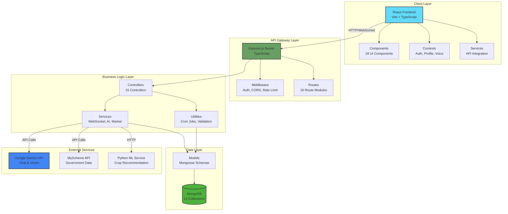

---

## Technology Stack

### Frontend Stack

| Technology | Version | Purpose |
|------------|---------|---------|
| **React** | 18.3 | UI framework |
| **TypeScript** | 5.5 | Type safety |
| **Vite** | 5.4 | Build tool & dev server |
| **TailwindCSS** | 3.4 | Styling framework |
| **i18next** | 25.8 | Internationalization |
| **Recharts** | 2.10 | Data visualization |
| **Axios** | 1.6 | HTTP client |
| **Socket.IO Client** | 4.8 | Real-time communication |
| **Lucide React** | 0.344 | Icon library |
| **Firebase** | 10.12 | Authentication & storage |

### Backend Stack

| Technology | Version | Purpose |
|------------|---------|---------|
| **Node.js** | 18+ | Runtime environment |
| **Express.js** | 4.19 | Web framework |
| **TypeScript** | 5.5 | Type safety |
| **MongoDB** | 8.6 | Database |
| **Mongoose** | 8.6 | ODM for MongoDB |
| **JWT** | 9.0 | Authentication |
| **bcryptjs** | 2.4 | Password hashing |
| **Socket.IO** | 4.8 | WebSocket server |
| **Node-cron** | 4.2 | Scheduled tasks |
| **Helmet** | 7.1 | Security headers |
| **CORS** | 2.8 | Cross-origin requests |
| **Morgan** | 1.10 | HTTP logging |
| **Zod** | 3.23 | Schema validation |

### AI/ML Stack

| Technology | Purpose |
|------------|---------|
| **Google Gemini API** | Conversational AI & image analysis |
| **Gemini Vision** | Crop disease detection |
| **Python + scikit-learn** | Crop recommendation ML model |
| **Streamlit** | ML model interface (optional) |

### DevOps & Tools

| Technology | Purpose |
|------------|---------|
| **Git** | Version control |
| **npm Workspaces** | Monorepo management |
| **Concurrently** | Run multiple processes |
| **Nodemon** | Auto-restart dev server |
| **ESLint** | Code linting |

---

## Component Architecture

### Frontend Architecture

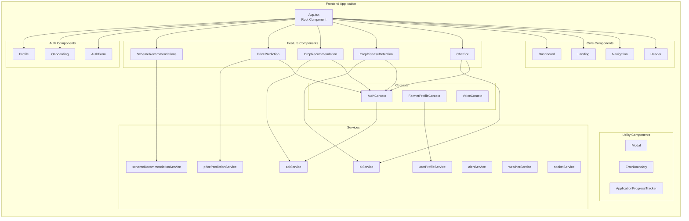

#### Component Breakdown

**Core Components (4)**
- [Header.tsx](file:///d:/KisanSaathi/frontend/src/components/Header.tsx) - App header with navigation
- [Navigation.tsx](file:///d:/KisanSaathi/frontend/src/components/Navigation.tsx) - Main navigation menu
- [Landing.tsx](file:///d:/KisanSaathi/frontend/src/components/Landing.tsx) - Landing page
- [Dashboard.tsx](file:///d:/KisanSaathi/frontend/src/components/Dashboard.tsx) - User dashboard

**AI/ML Components (5)**
- [ChatBot.tsx](file:///d:/KisanSaathi/frontend/src/components/ChatBot.tsx) - AI chatbot interface
- [ChatHistory.tsx](file:///d:/KisanSaathi/frontend/src/components/ChatHistory.tsx) - Chat history viewer
- [CropDiseaseDetection.tsx](file:///d:/KisanSaathi/frontend/src/components/CropDiseaseDetection.tsx) - Disease detection
- [DiseaseHistory.tsx](file:///d:/KisanSaathi/frontend/src/components/DiseaseHistory.tsx) - Disease history
- [CropRecommendation.tsx](file:///d:/KisanSaathi/frontend/src/components/CropRecommendation.tsx) - Crop recommendations

**Market Components (1)**
- [PricePrediction.tsx](file:///d:/KisanSaathi/frontend/src/components/PricePrediction.tsx) - AI-generated market prices

**Information Components (1)**
- [SchemeRecommendations.tsx](file:///d:/KisanSaathi/frontend/src/components/SchemeRecommendations.tsx) - Government schemes

**Auth Components (3)**
- [AuthForm.tsx](file:///d:/KisanSaathi/frontend/src/components/AuthForm.tsx) - Login/register form
- [Onboarding.tsx](file:///d:/KisanSaathi/frontend/src/components/Onboarding.tsx) - User onboarding
- [Profile.tsx](file:///d:/KisanSaathi/frontend/src/components/Profile.tsx) - User profile

**Utility Components (3)**
- [Modal.tsx](file:///d:/KisanSaathi/frontend/src/components/Modal.tsx) - Reusable modal
- [ErrorBoundary.tsx](file:///d:/KisanSaathi/frontend/src/components/ErrorBoundary.tsx) - Error handling
- [ApplicationProgressTracker.tsx](file:///d:/KisanSaathi/frontend/src/components/ApplicationProgressTracker.tsx) - Progress tracking

### Backend Architecture

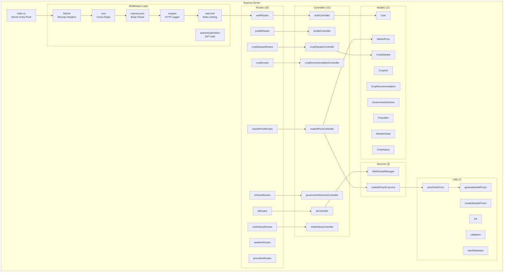

#### Backend Component Breakdown

**Controllers (15)**
- Authentication & user management
- AI chatbot interactions
- Crop disease detection
- Crop recommendations
- Market price data
- Government schemes
- Price alerts
- Weather data
- Chat history

**Services (3)**
- [WebSocketManager.ts](file:///d:/KisanSaathi/server/src/services/WebSocketManager.ts) - Real-time communication
- [marketPriceAI.service.ts](file:///d:/KisanSaathi/server/src/services/marketPriceAI.service.ts) - AI price generation

**Utilities (7)**
- [priceFetchCron.ts](file:///d:/KisanSaathi/server/src/utils/priceFetchCron.ts) - Automated price updates
- [generateInitialPrices.ts](file:///d:/KisanSaathi/server/src/utils/generateInitialPrices.ts) - Initial price data
- [createSamplePrices.ts](file:///d:/KisanSaathi/server/src/utils/createSamplePrices.ts) - Sample data
- [jwt.ts](file:///d:/KisanSaathi/server/src/utils/jwt.ts) - JWT utilities
- [validation.ts](file:///d:/KisanSaathi/server/src/utils/validation.ts) - Input validation
- [seedDatabase.ts](file:///d:/KisanSaathi/server/src/utils/seedDatabase.ts) - Database seeding

---

## Database Schema

### MongoDB Collections (12)

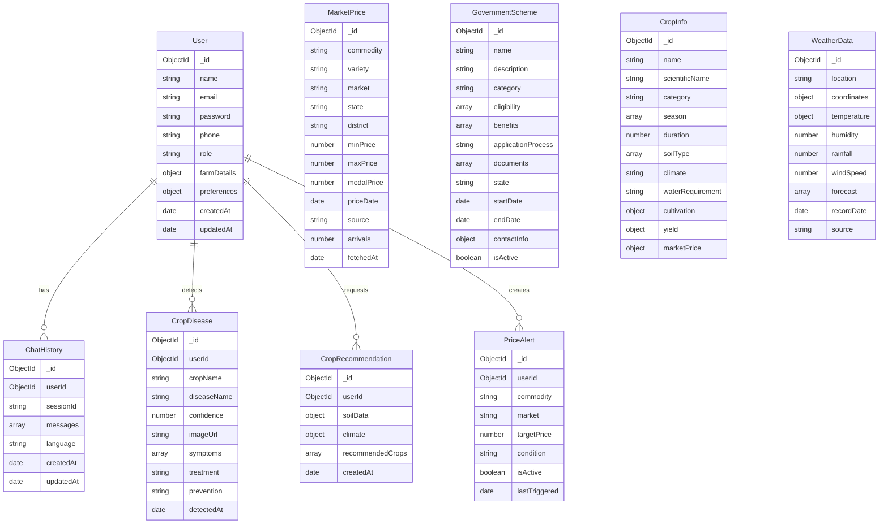

### Key Indexes

**Performance Optimization**

- `User.email` - Unique index for fast login
- `MarketPrice.{commodity, market, priceDate}` - Compound index for price queries
- `CropDisease.{userId, detectedAt}` - User history queries
- `ChatHistory.{userId, sessionId}` - Session retrieval
- `GovernmentScheme.{state, isActive}` - Scheme filtering

---

## API Architecture

### API Endpoint Structure

```
/api
├── /auth                    # Authentication
│   ├── POST /register       # User registration
│   ├── POST /login          # User login
│   └── POST /logout         # User logout
│
├── /profile                 # User Profile
│   ├── GET /                # Get profile
│   └── PUT /                # Update profile
│
├── /ai                      # AI Features
│   ├── POST /chat           # Chat with AI
│   └── GET /chat/history    # Chat history
│
├── /crop                    # Crop Recommendations
│   ├── POST /recommendation # Get recommendations
│   └── GET /history         # Recommendation history
│
├── /market-prices           # Market Prices (AI-Generated)
│   ├── GET /                # Get all prices (with filters)
│   ├── GET /ai-status       # AI generation status
│   └── POST /fetch-ai-prices # Trigger AI generation
│
├── /schemes                 # Government Schemes
│   ├── GET /                # Get all schemes
│   ├── GET /:id             # Get scheme details
│   ├── POST /               # Create scheme (admin)
│   ├── PUT /:id             # Update scheme (admin)
│   └── DELETE /:id          # Delete scheme (admin)
│
├── /crop-disease            # Crop Disease Detection
│   ├── POST /detect         # Detect disease
│   ├── GET /history         # Detection history
│   └── DELETE /history/:id  # Delete history entry
│
├── /alerts                  # Price Alerts
│   ├── GET /                # Get user alerts
│   ├── POST /               # Create alert
│   ├── PUT /:id             # Update alert
│   └── DELETE /:id          # Delete alert
│
├── /weather                 # Weather Data
│   ├── GET /current         # Current weather
│   └── GET /forecast        # 7-day forecast
│
├── /chat                    # Chat History
│   ├── GET /                # Get all sessions
│   ├── GET /:id             # Get session
│   └── DELETE /:id          # Delete session
│
└── /health                  # Health Checks
    ├── GET /                # Server health
    └── GET /database        # Database status
```

### Authentication Flow

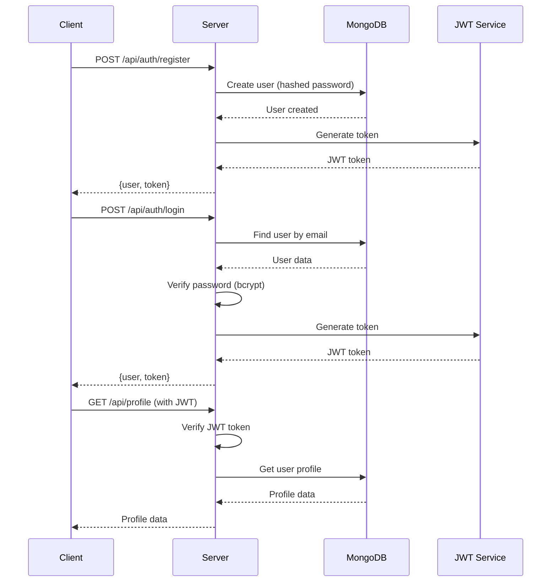

---

## Data Flow

### AI Chatbot Flow

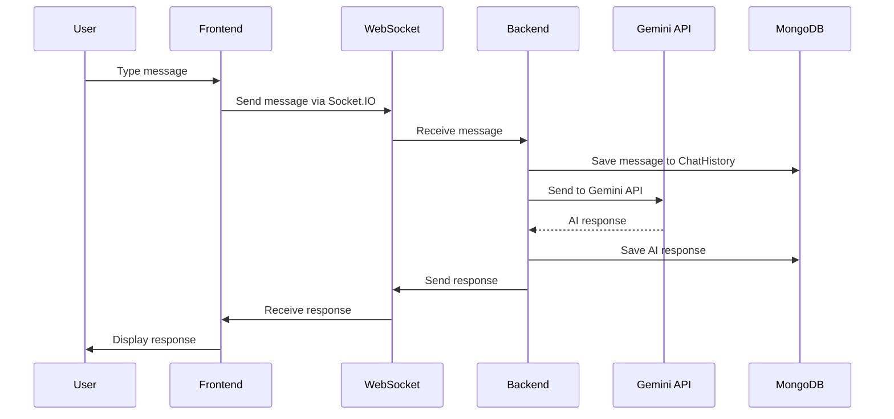

### Crop Disease Detection Flow

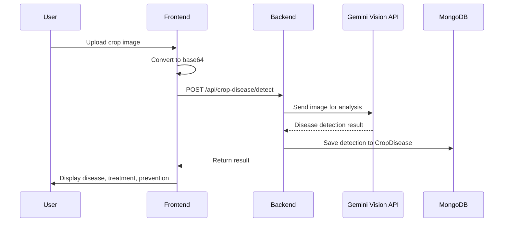

### Market Price Generation Flow

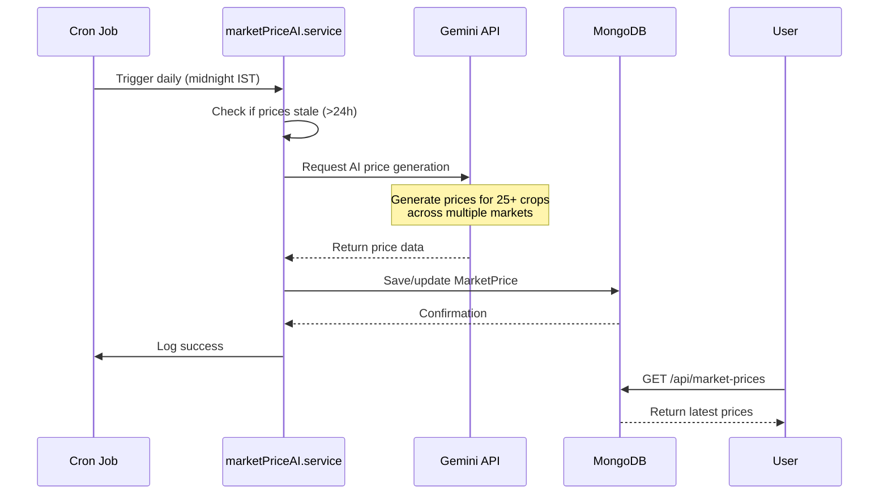

### Crop Recommendation Flow

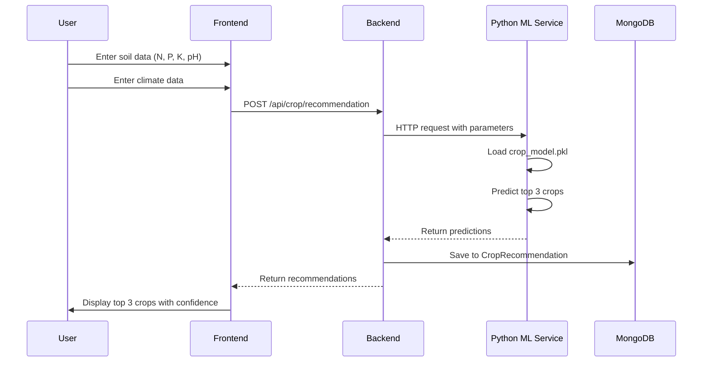

---

## Security Architecture

### Security Layers

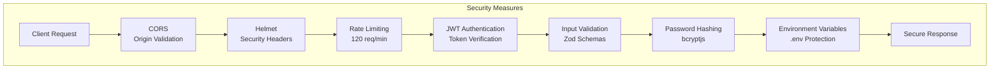

### Security Features

**1. Authentication & Authorization**
- JWT-based authentication
- Token expiration and refresh
- Role-based access control (farmer, admin, expert)
- Password hashing with bcryptjs (10 rounds)

**2. API Security**
- CORS configuration with allowed origins
- Helmet.js for security headers
- Rate limiting (120 requests/minute per IP)
- Input validation with Zod schemas
- Request size limits (10MB max)

**3. Data Security**
- Environment variable protection
- MongoDB connection string encryption
- Sensitive data exclusion from responses
- HTTPS enforcement (production)

**4. Error Handling**
- Graceful error responses
- No stack trace exposure (production)
- Centralized error middleware
- Logging with Morgan

---

## AI/ML Integration

### Google Gemini Integration

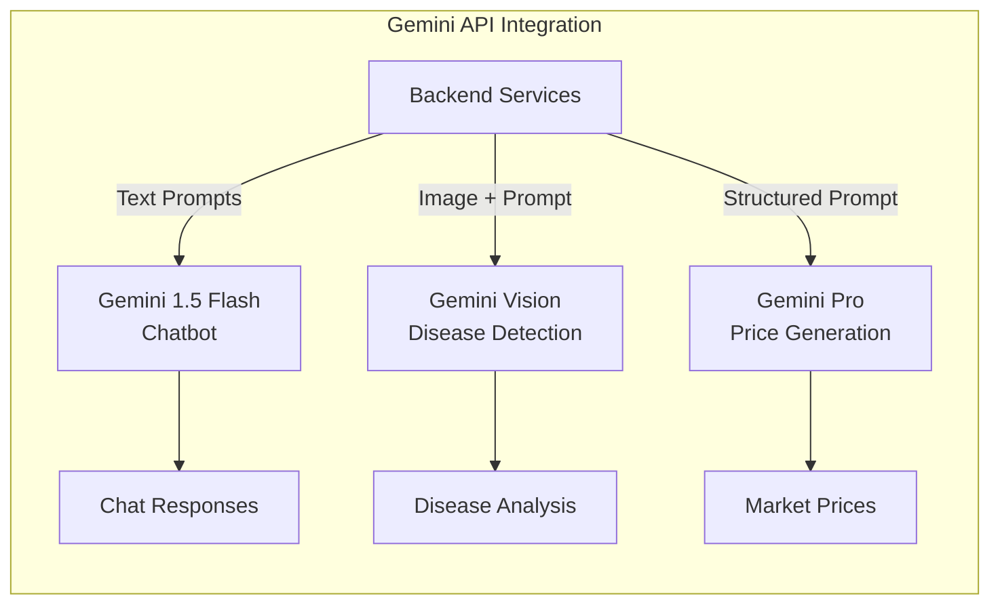

**Gemini Use Cases**

1. **Conversational AI (Gemini 1.5 Flash)**
   - Multilingual farming advice
   - Context-aware responses
   - Real-time chat via WebSocket

2. **Crop Disease Detection (Gemini Vision)**
   - Image analysis
   - Disease identification
   - Treatment recommendations
   - Prevention strategies

3. **Market Price Generation (Gemini Pro)**
   - Daily price generation for 25+ crops
   - Multi-market coverage
   - Realistic pricing based on seasonal patterns
   - Automated cron job execution

### Python ML Service

**Crop Recommendation System**

```
Crop-Recommendation-System/
├── app.py                  # Streamlit interface
├── predict.py              # Prediction logic
├── predict_wrapper.py      # API wrapper
├── train.py                # Model training
├── crop_model.pkl          # Trained model (11MB)
└── data.xlsx               # Training dataset
```

**Model Details**
- **Algorithm**: Random Forest / Decision Tree
- **Input Features**: N, P, K, Temperature, Humidity, pH, Rainfall
- **Output**: Top 3 crop recommendations with confidence scores
- **Integration**: HTTP API endpoint called by backend

---

## Deployment Architecture

### Development Environment

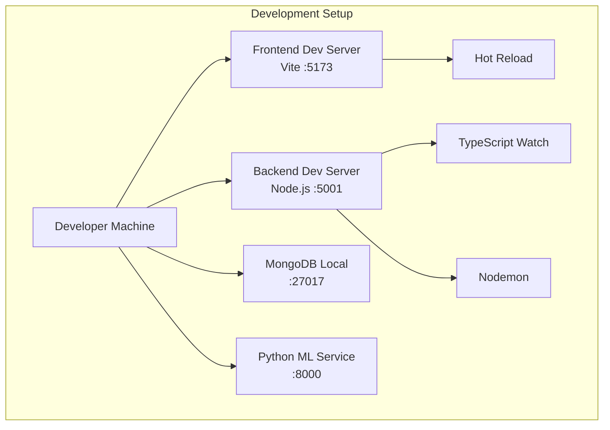

**Development Commands**
```bash
# Install all dependencies
npm install

# Start both frontend and backend
npm run dev

# Or start separately
npm run dev:frontend  # Port 5173
npm run dev:backend   # Port 5001
```

### Production Architecture

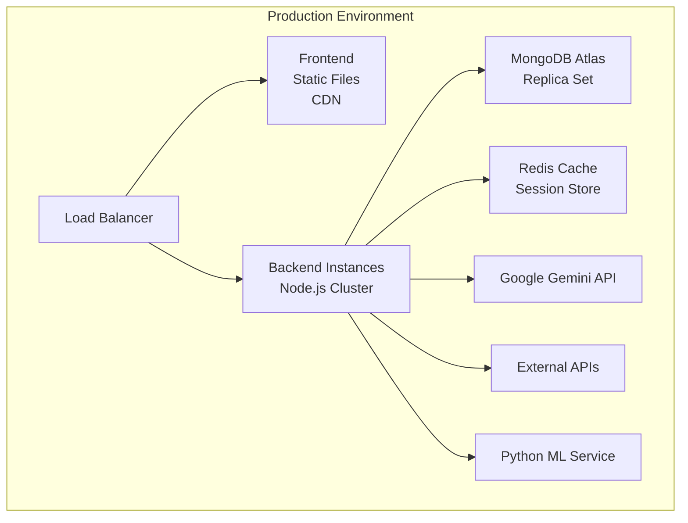

**Production Considerations**
- **Frontend**: Static build deployed to CDN (Vercel/Netlify)
- **Backend**: Node.js cluster with PM2 process manager
- **Database**: MongoDB Atlas with replica sets
- **Caching**: Redis for session management and caching
- **Monitoring**: Application logs, error tracking
- **CI/CD**: Automated deployment pipeline

---

## Cron Jobs & Automation

### Scheduled Tasks

**1. Market Price Generation**
- **Schedule**: Daily at midnight IST
- **File**: [priceFetchCron.ts](file:///d:/KisanSaathi/server/src/utils/priceFetchCron.ts)
- **Function**: Generates AI prices for 25+ crops
- **Process**:
  1. Check if prices are stale (>24 hours)
  2. Call Gemini API for price generation
  3. Update MongoDB with new prices
  4. Log success/failure

**Cron Expression**: `0 0 * * *` (midnight daily)

---

## WebSocket Architecture

### Real-time Communication

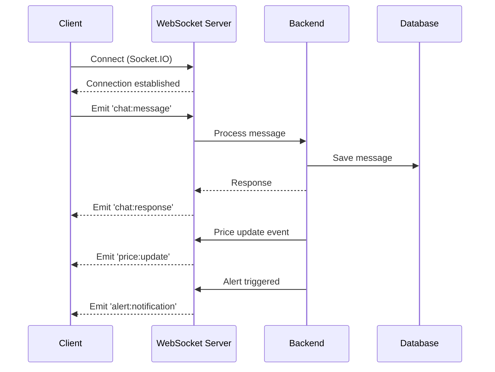

**WebSocket Events**
- `chat:message` - User sends chat message
- `chat:response` - AI response
- `price:update` - Market price updates
- `alert:notification` - Price alert triggered
- `disease:detected` - Disease detection complete

---

## Environment Configuration

### Required Environment Variables

**Backend (.env)**
```env
# Server
PORT=5001
NODE_ENV=development

# Database
MONGODB_URI=mongodb://localhost:27017/kisansaathi

# Authentication
JWT_SECRET=your_secret_key

# Google Gemini
GEMINI_API_KEY=your_gemini_api_key

# CORS
CLIENT_ORIGIN=http://localhost:5173
```

**Frontend (.env)**
```env
# API Configuration
VITE_SERVER_URL=http://localhost:5001
```

---

## Performance Optimization

### Backend Optimizations

1. **Database Indexes**: Compound indexes on frequently queried fields
2. **Connection Pooling**: MongoDB connection pool
3. **Compression**: Gzip compression middleware
4. **Rate Limiting**: Prevent API abuse
5. **Caching**: In-memory caching for static data

### Frontend Optimizations

1. **Code Splitting**: Lazy loading components
2. **Tree Shaking**: Vite build optimization
3. **Asset Optimization**: Image compression
4. **Memoization**: React.memo for expensive components
5. **Virtual Scrolling**: For large lists

---

## Future Enhancements

### Planned Features

1. **Advanced ML Models**
   - Custom CNN for disease detection
   - LSTM for price forecasting
   - Yield prediction models

2. **IoT Integration**
   - Soil sensor data integration
   - Weather station connectivity
   - Automated irrigation control

3. **Multi-platform**
   - WhatsApp bot integration
   - Telegram bot
   - Mobile apps (React Native)

4. **Enhanced Features**
   - Voice assistant (full integration)
   - Offline PWA mode
   - Community forums
   - E-commerce marketplace

---

## Appendix

### Project Statistics

- **Frontend Components**: 18
- **Backend Controllers**: 15
- **API Routes**: 16
- **Database Models**: 12
- **Services**: 8 (Frontend) + 3 (Backend)
- **Contexts**: 4
- **Custom Hooks**: 8
- **Total Lines of Code**: ~50,000+

### Key Files Reference

**Backend**
- [index.ts](file:///d:/KisanSaathi/server/src/index.ts) - Server entry point
- [Models README](file:///d:/KisanSaathi/server/src/models/README.md) - Database schema docs
- [Routes README](file:///d:/KisanSaathi/server/src/routes/README.md) - API endpoint docs

**Frontend**
- [App.tsx](file:///d:/KisanSaathi/frontend/src/App.tsx) - Root component
- [Components README](file:///d:/KisanSaathi/frontend/src/components/README.md) - Component docs

**ML**
- [app.py](file:///d:/KisanSaathi/Crop-Recommendation-System/app.py) - ML service

### Documentation Links

- [Main README](file:///d:/KisanSaathi/README.md) - Project overview
- [Migration Guide](file:///d:/KisanSaathi/frontend/MIGRATION_GUIDE.md) - i18next migration

---

**Document Version**: 1.0  
**Last Updated**: 2026-02-05  
**Maintained By**: KisanSaathi Development Team
